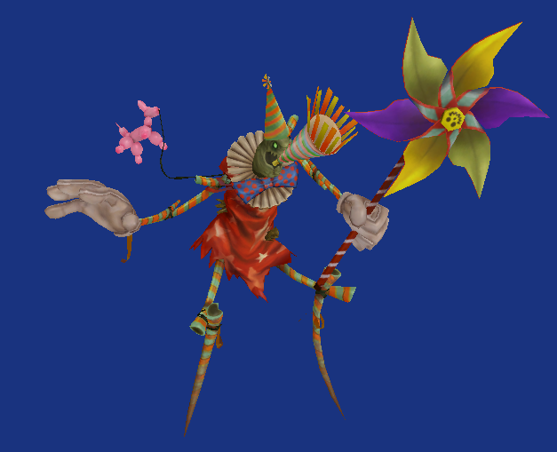
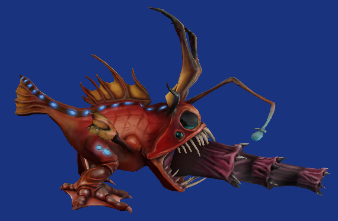

# LOL Model Viewer

This project allows users to view models from League of Legends. It is useful for people looking to preview champion skins before purchasing or machinimists.

### Project Status

League of Legends has evolved faster than our reverse engineering efforts. Unfortunately, this project no longer works with a live build of the game. However, a compatible version of Super Teemo still lurks about the repository for your viewing pleasure.

### Dependencies

OpenTK - http://www.opentk.com/

RAF Manager Plus - http://code.google.com/p/raflib-plus/

zlib - http://zlib.net/ - http://zlibnetwrapper.sourceforge.net/

#### License

GPLv3

### Screen Shots

